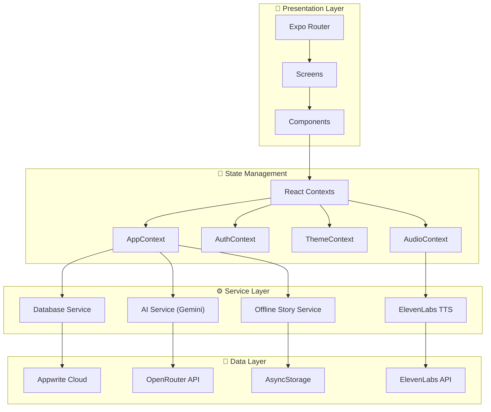

<div align="center">
  
  <h1>Jahera</h1>
  <p><strong>AI-powered personalized stories for families. Magical. Educational. Yours.</strong></p>

  <p>
    <a href="https://github.com/Kh3rwa1/Jahera_kid_story/actions/workflows/ci.yml">
      
    </a>
    
    
    
    
    
  </p>

  <!-- Add your device mockup screenshots here -->
  <!--  -->
</div>

---

## ✨ Features

| Feature                          | Description                                                                                             |
| -------------------------------- | ------------------------------------------------------------------------------------------------------- |
| 🧠 **Behavior-Driven Stories**   | 12 learning goals (confidence, sharing, kindness, courage, discipline) backed by bibliotherapy research |
| 🎙️ **Voice Personas**            | Mom, Dad, Grandma, Fun Narrator, Hindi Dadi — powered by ElevenLabs TTS in 24 languages                 |
| 📱 **Offline-First**             | Full story access without internet — auto-caches stories with audio, syncs when back online             |
| 🎨 **8 Themes + Custom Colors**  | Crimson Magic, Night Sky (dark mode), Mint Fresh, Purple Dream, and more with a custom color wheel      |
| 🛡️ **Parent-First Architecture** | COPPA/DPDP compliant with parent consent gate, PIN security, no child accounts                          |
| 🧪 **Interactive Quizzes**       | AI-generated comprehension quizzes after every story                                                    |
| 🔔 **Bedtime Reminders**         | Daily push notifications with custom time picker                                                        |
| 📊 **Behavior Progress**         | 30-day visual progress tracking of learning goals                                                       |
| 🔒 **Prompt Security**           | Input sanitization + AI safety filter against prompt injection                                          |

## 📸 Screenshots

<!-- Replace these with actual screenshots in device frames -->
<!-- Use https://shots.so or https://app-mockup.com to create device mockups -->

<div align="center">
  <em>Coming soon — see the app in action on <a href="https://play.google.com/store/apps/details?id=com.hindi.harp">Google Play</a></em>
</div>

## 🏛️ Architecture



## 🛠️ Tech Stack

| Layer             | Technology                                 |
| ----------------- | ------------------------------------------ |
| **Framework**     | React Native 0.81 + Expo SDK 54            |
| **Language**      | TypeScript 5.9                             |
| **Routing**       | Expo Router 6 (file-based)                 |
| **Backend**       | Appwrite (Database, Auth, Cloud Functions) |
| **AI Engine**     | Google Gemini 2.0 Flash via OpenRouter     |
| **Voice**         | ElevenLabs Text-to-Speech (24 languages)   |
| **Subscriptions** | RevenueCat                                 |
| **Notifications** | expo-notifications                         |
| **Animations**    | react-native-reanimated                    |
| **Icons**         | Lucide React Native                        |
| **CI/CD**         | GitHub Actions + EAS Build                 |

## 🚀 Quick Start

```bash
# Clone the repo
git clone https://github.com/Kh3rwa1/Jahera_kid_story.git
cd Jahera_kid_story

# Install dependencies
npm install

# Set up environment variables
cp .env.example .env
# Edit .env with your API keys (see docs/API_KEYS_SETUP.md)

# Start the development server
npm run dev
```

### Environment Variables

```bash
# Appwrite Configuration
EXPO_PUBLIC_APPWRITE_ENDPOINT=https://cloud.appwrite.io/v1
EXPO_PUBLIC_APPWRITE_PROJECT_ID=your_project_id
EXPO_PUBLIC_APPWRITE_DATABASE_ID=your_database_id
EXPO_PUBLIC_APPWRITE_PLATFORM=com.hindi.harp

# AI & Voice
EXPO_PUBLIC_OPENROUTER_API_KEY=your_openrouter_key
EXPO_PUBLIC_ELEVENLABS_API_KEY=your_elevenlabs_key
```

> See [docs/API_KEYS_SETUP.md](docs/API_KEYS_SETUP.md) for detailed setup instructions.

## 📂 Project Structure

```text
jahera/
├── app/                          # Expo Router screens
│   ├── (tabs)/                   # Tab navigation (Home, Library, Settings)
│   ├── auth/                     # Login & registration
│   ├── onboarding/               # Consent + profile setup
│   ├── settings/                 # Audio, notifications, theme
│   ├── story/                    # Generate, playback, quiz
│   └── _layout.tsx               # Root layout with providers
├── components/                   # Reusable UI components
│   ├── ErrorBoundary.tsx         # Global error catching
│   ├── ErrorState.tsx            # Error display (network/server/generic)
│   ├── LoadingSkeleton.tsx       # Shimmer loading states
│   ├── BehaviorGoalPicker.tsx    # Learning goal selection
│   ├── VoicePresetPicker.tsx     # Voice persona picker
│   ├── ColorWheelPicker.tsx      # Custom theme color picker
│   └── FloatingTabBar.tsx        # Animated bottom navigation
├── contexts/                     # React Context providers
│   ├── AppContext.tsx            # Global app state & profile
│   ├── AuthContext.tsx           # Authentication state
│   ├── ThemeContext.tsx          # Theme management (8 themes)
│   └── AudioContext.tsx          # Audio playback state
├── services/                     # Business logic & API clients
│   ├── aiService.ts              # Gemini AI story generation
│   ├── audioService.ts           # ElevenLabs TTS
│   ├── database.ts               # Appwrite database operations
│   ├── offlineStoryService.ts    # Offline caching & sync
│   └── analyticsService.ts      # Analytics tracking
├── utils/                        # Utilities
│   ├── errorHandler.ts           # Centralized error handling
│   ├── validation.ts             # Input validation & sanitization
│   ├── promptSanitizer.ts        # AI prompt security
│   └── storySafetyFilter.ts     # Content safety filtering
├── constants/                    # App constants
│   ├── themeSchemes.ts           # 8 color scheme definitions
│   ├── behaviorGoals.ts          # 12 learning goals
│   └── voicePresets.ts           # Voice persona configs
└── assets/                       # Images, Lottie animations, video
```

## 🔒 Privacy & Compliance

- **No GPS data collected** — location is manually entered by parents
- **Parent-first architecture** — parent is the sole account holder
- **Consent gate** — verifiable parental consent at onboarding
- **No child accounts** — all data stored under parent profile
- **Input sanitization** — all user strings cleaned before AI processing
- **AI safety filter** — server-side content filtering with 20-story fallback bank
- **COPPA (US) and DPDP (India) considerations** built into the design

> See our [Privacy Policy](docs/privacy-policy.html) for full details.

## 🤝 Contributing

We welcome contributions! Please follow these steps:

1. Fork the repository
2. Create a feature branch (`git checkout -b feat/amazing-feature`)
3. Commit using [Conventional Commits](https://www.conventionalcommits.org/) (`git commit -m 'feat: add amazing feature'`)
4. Push to your branch (`git push origin feat/amazing-feature`)
5. Open a Pull Request

> **Note:** This project uses Husky + commitlint to enforce conventional commit messages.

## 📄 License

MIT

---

<div align="center">
  <p>Made with ❤️ for families everywhere</p>
  <p>
    <a href="https://github.com/Kh3rwa1/Jahera_kid_story/issues">Report Bug</a>
    ·
    <a href="https://github.com/Kh3rwa1/Jahera_kid_story/issues">Request Feature</a>
  </p>
</div>
